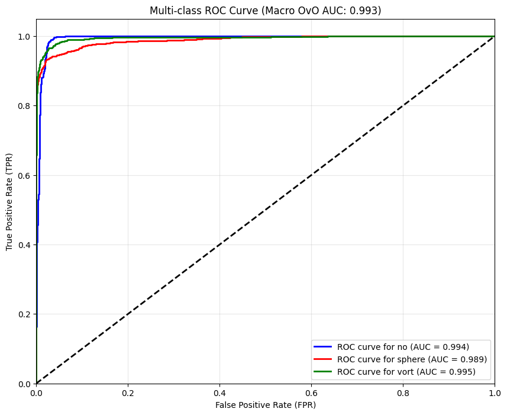

# Common Test I: Multi-Class Classification

This folder contains my solution for the DeepLense common classification task: predict which type of lensing image is present in each sample.

The three target classes are:

- no substructure
- subhalo substructure
- vortex substructure

## Files

- `task_common.ipynb`: training, validation, evaluation, confusion matrix, and ROC analysis
- `best_lens_model.pth`: saved best checkpoint from the notebook run
- `result.png`: saved result figure for this task

## Approach

I used a transfer-learning baseline built on a pretrained `ResNet-18` from `torchvision`.

The notebook:

- loads `.npy` images through a custom `NumpyLensDataset`
- resizes images to `224 x 224`
- applies horizontal flips, vertical flips, and `90` degree rotations during training
- fine-tunes the final classification head for `3` classes

Training setup in the notebook:

- loss: `CrossEntropyLoss`
- optimizer: `AdamW`
- scheduler: `ReduceLROnPlateau`
- batch size: `32`
- epochs: `30`

## Dataset Setup

The notebook currently expects the dataset under:

- `dataset/train`
- `dataset/val`

The provided validation split is then divided in half again to create:

- a validation split used for model selection
- a held-out test split used for the final report

The run stored in the notebook uses:

- `30000` training samples
- `3750` validation samples
- `3750` test samples

## Reported Result

The saved evaluation in the notebook reports:

- test accuracy: `0.95`
- macro precision: `0.95`
- macro recall: `0.95`
- macro F1: `0.95`

Per-class F1 scores from the notebook:

- `no`: `0.96`
- `sphere`: `0.93`
- `vort`: `0.95`

The notebook also generates:

- a confusion matrix
- per-class ROC curves
- a macro one-vs-one AUC summary on the held-out test split

## Result Preview

## Reproducing

1. Download the challenge dataset and place it under the expected `dataset` directory.
2. Update the path cell in `task_common.ipynb` if your local layout is different.
3. Run the notebook cells top to bottom.

