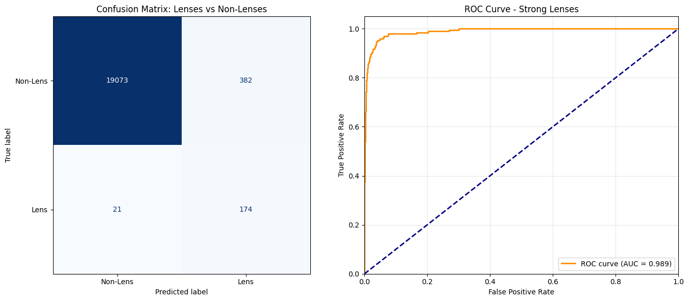
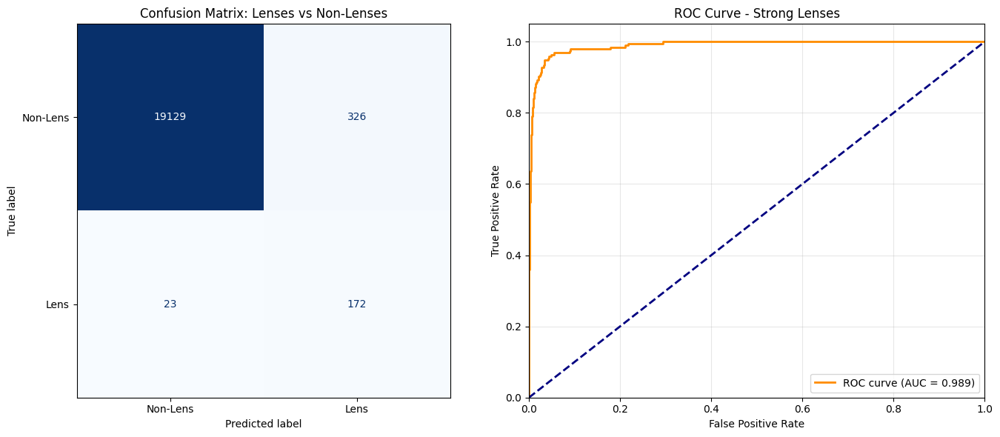
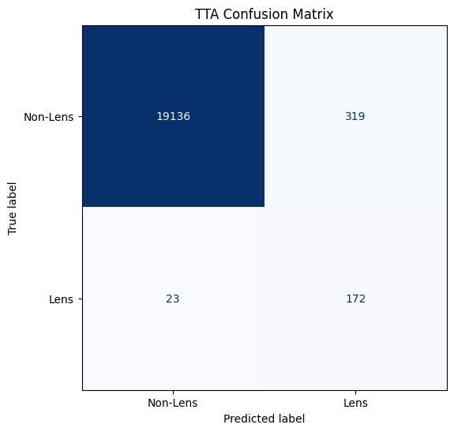

# Specific Test V: Lens Finding And Data Pipelines

This folder contains my solution for the binary lens-finding task: classify each `3 x 64 x 64` object as either lens or non-lens.

## Files

- `task_5.ipynb`: full data pipeline, training, hard-negative mining, and evaluation
- `best_lens_attention_model.pth`: best checkpoint from the initial training phase
- `finetuned_lens_model.pth`: checkpoint after the hard-negative fine-tuning phase
- `result_1.png`: baseline evaluation plots from the main model
- `result_2.png`: evaluation plots after the hard-negative bootcamp fine-tuning phase
- `result_3.png`: final evaluation plots after test-time augmentation

## Approach

The main model is a custom CNN with a spatial attention block:

- shallow convolutional feature extractor
- `SpatialAttention` module to highlight informative regions
- deeper convolutional block
- dropout-regularized classifier head

Because the dataset is heavily imbalanced, the notebook uses:

- `BinaryFocalLoss` to emphasize the rare positive lens class
- a two-stage workflow with hard-negative mining
- test-time augmentation at inference

In the current notebook version, the focal-loss configuration is:

- `alpha = 0.50`
- `gamma = 2.0`

## Training Strategy

Stage 1 is standard training on the original train split.

Stage 2 is a "bootcamp" fine-tuning pass:

- run the trained model over the training set
- rank non-lens examples by absolute prediction error
- keep the `1500` hardest non-lenses
- combine them with all lens examples
- fine-tune the model again with a lower learning rate

In the saved run, the mined bootcamp split contains:

- `1381` lens examples
- `1500` hard non-lens examples
- `2881` total fine-tuning samples

At test time the notebook averages predictions across:

- original image
- horizontal flip
- vertical flip
- `90` degree rotation

## Dataset Setup

The notebook expects the challenge data in four folders:

- `train_lenses`
- `train_nonlenses`
- `test_lenses`
- `test_nonlenses`

It then creates its own train and validation split from the training portion.

The run stored in the notebook uses:

- `24324` training samples
- `6081` validation samples
- `19650` test samples

## Reported Result

Baseline evaluation with the first saved checkpoint:

- accuracy: `0.98`
- macro precision: `0.66`
- macro recall: `0.94`
- macro F1: `0.73`
- test AUC: `0.9890`

Evaluation after the hard-negative bootcamp fine-tuning phase:

- accuracy: `0.98`
- macro precision: `0.67`
- macro recall: `0.93`
- macro F1: `0.74`
- test AUC: `0.9894`

Final evaluation with the fine-tuned model plus test-time augmentation:

- accuracy: `0.98`
- macro precision: `0.67`
- macro recall: `0.93`
- macro F1: `0.75`
- test AUC: `0.9895`

## Result Preview

Baseline evaluation result:

Bootcamp fine-tuned evaluation result:

Fine-tuned plus TTA result:

## Reproducing

1. Download the dataset and place the four challenge folders under the base directory used in the notebook.
2. Update the dataset path cell in `task_5.ipynb` if needed.
3. Run the notebook top to bottom to train, mine hard negatives, fine-tune, and evaluate.

## Notes

- This solution puts emphasis on recall and ranking quality than on raw positive-class precision.
- The hard-negative phase and the final TTA pass are the significant contributors to the final reported score.