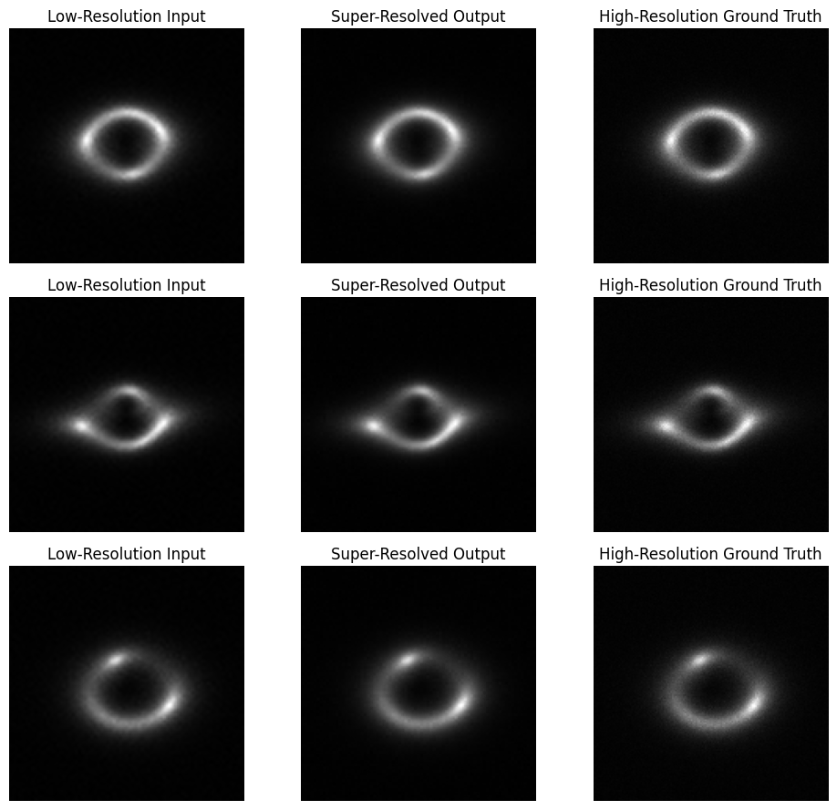
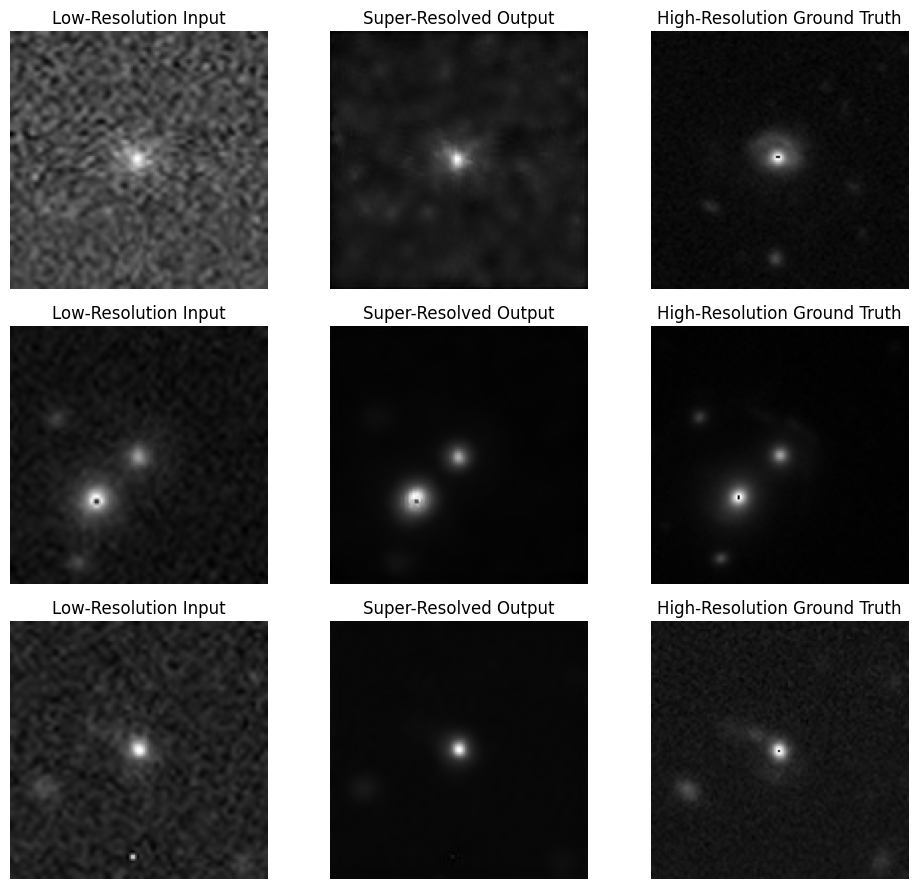

# Specific Test VI: Image Super-Resolution

This folder covers both parts of Test VI:

- Task VI.A: super-resolution on the synthetic strong-lensing dataset
- Task VI.B: super-resolution on the limited real HSC/HST-style HR/LR pairs

## Files

- `task_6a.ipynb`: synthetic-data super-resolution workflow
- `best_model_6a.pth`: best checkpoint for Task VI.A
- `results1.png`: qualitative visualization from Task VI.A
- `task_6b.ipynb`: limited-data real-pair workflow
- `best_model_6b.pth`: best checkpoint for Task VI.B
- `results2.png`: qualitative visualization from Task VI.B

## Core Model

Both notebooks use an `RCAN`-style super-resolution network built from:

- `ChannelAttention`
- `RCAB` residual channel attention blocks
- `RG` residual groups
- transposed-convolution upscaling plus bicubic resizing to the final output size

Training tracks:

- L1 loss
- MSE
- PSNR
- SSIM

## Task VI.A: Synthetic HR/LR Pairs

This notebook trains the RCAN model directly on the provided synthetic strong-lensing pairs.

Reported final test metrics in the notebook:

- L1 loss: `0.0049`
- MSE loss: `0.0001`
- PSNR: `42.32 dB`
- SSIM: `0.9745`

### Task VI.A Preview

## Task VI.B: Limited Real HR/LR Pairs

This notebook keeps the same model family but adapts it for the much smaller real-pair dataset.

The workflow first expands the data with augmentation:

- original real dataset size: `300` pairs
- augmented dataset created in the notebook: `1200` HR/LR pairs

The augmentation stage applies:

- horizontal flips
- vertical flips
- rotations
- light LR noise injection

Reported final test metrics in the notebook:

- L1 loss: `0.0174`
- MSE loss: `0.0013`
- PSNR: `29.95 dB`
- SSIM: `0.8217`

### Task VI.B Preview

## Dataset Setup

The notebooks currently expect local paths similar to the original training environment.

Task VI.B specifically uses:

- `Dataset_6b/HR`
- `Dataset_6b/LR`
- `Augmented_Dataset_6b/HR`
- `Augmented_Dataset_6b/LR`

If your directory layout differs, update the path cells before running.

## Reproducing

1. Download the challenge datasets for VI.A and VI.B.
2. Update the dataset path cells in `task_6a.ipynb` and `task_6b.ipynb`.
3. Run each notebook top to bottom.

## Notes

- I kept the architecture consistent across both parts so the limited-data setting could benefit from the same inductive bias.
- VI.B is notably harder than VI.A because of the much smaller and more realistic training set.
