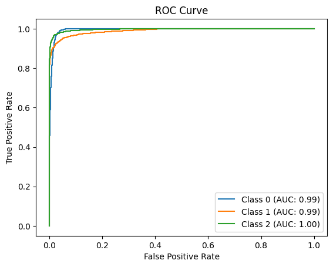

# Specific Test VII: Physics-Guided ML

This folder contains my physics-informed solution for the three-class lens classification task.

## Files

- `task_7.ipynb`: full training and evaluation workflow
- `results.png`: qualitative output saved from the notebook
- `best_model.pth`: best checkpoint produced in the local workspace run

## Approach

The main model is `PhysicsInformedFusionNet`, which combines:

- a physics-informed encoder built around the gravitational lens equation with an SIS-style inverse lensing step
- transformer-style patch processing through `MultiLocallySelfAttention` and `TransformerLSABlock`
- a fusion stage that concatenates the original image with the physics-informed reconstruction
- an `EfficientNet-B0` classifier whose first convolution is modified to accept `2` channels

This design tries to inject lensing structure directly into the feature pipeline instead of relying on image appearance alone.

## Training Setup

The notebook uses:

- loss: `CrossEntropyLoss`
- optimizer: `Adam`
- scheduler: `StepLR`
- checkpointing based on validation macro AUC

The data path in the notebook is currently:

- training split: `dataset/train`
- evaluation split: `dataset/val`

## Reported Result

The saved run in the notebook reaches:

- best validation macro AUC: `0.9924`
- final mean test AUC: `0.9933`

The notebook also plots ROC curves for the final evaluation.

## Result Preview

## Reproducing

1. Download the challenge dataset and place it under the expected `dataset` folder.
2. Update the path cells in `task_7.ipynb` if your local layout is different.
3. Run the notebook to train and evaluate the fusion model.

## Notes

- The physics-informed branch is the central difference from the common-task baseline.
- The physics-informed transformer module and inverse-lensing encoder were adapted from work by [Lucas Veloso](https://medium.com/@lucas.jose.veloso.de.souza/lensiformer-a-relativistic-physics-informed-vision-transformer-architecture-for-dark-matter-a119f6d0dc0d). Specifically, those parts were adapted from the [Lensiformer GitHub repository](https://github.com/ML4SCI/DeepLense/tree/main/Physics_Informed_Transformers_For_Dark-Matter_Morphology_Lucas_Jose).
- The file size of the trained model were too large to push on Github. You can download it here: <https://drive.google.com/file/d/1DK-f1eRkcZxUe6KEeewP5K--mECwXyyi/view>.

