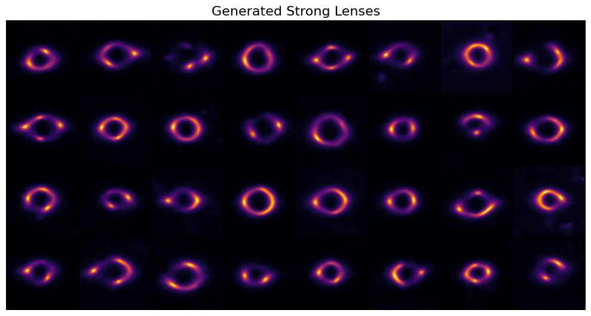

# Specific Test VIII: Diffusion Models

This folder contains my generative strong-lensing pipeline based on a VAE plus latent diffusion.

## Files

- `ldm.ipynb`: full end-to-end notebook for training, sampling, and evaluation
- `best_ldm_vae_ckpt.pth`: best VAE checkpoint
- `ldm_sharp_lenses_cosine_huge/`: diffusion checkpoints, including EMA weights used for generation
- `generated-images.png`: saved generation preview image

## Pipeline Overview

The notebook is split into two stages.

Stage 1 trains a custom grayscale VAE:

- input images are treated as `150 x 150` single-channel lens images
- the encoder pads them to `256 x 256`
- the latent space uses `3` channels at `32 x 32`
- training uses a beta-VAE style reconstruction plus KL objective

Stage 2 trains a latent diffusion model:

- a UNet with sinusoidal time embeddings
- residual blocks plus attention in the down, mid, and up paths
- cosine noise scheduler
- EMA shadow model for more stable sampling
- DDIM-style fast sampling from the trained EMA checkpoint

## Dataset Setup

The saved run uses:

- `9000` training images
- `700` validation images
- `300` test images

If your local directory layout is different, update the dataset path cells in `ldm.ipynb`.

## Reported Result

VAE stage metrics:

- final test loss on `300` unseen images: `0.005122`
- latent mean: `0.000981`
- latent standard deviation: `0.162196`
- recommended latent scale factor: `6.165381`

Diffusion stage metric from the notebook:

- FID on `5000` generated samples: `5.8864`
- Average Nearest-Neighbor SSIM: `0.8699`

## Result Preview

## Reproducing

1. Download the diffusion dataset and place the `.npy` files under the expected `Samples` directory.
2. Update the path cell in `ldm.ipynb` if needed.
3. Run the VAE stage first.
4. Run the latent diffusion training stage.
5. Use the EMA checkpoint for generation and FID evaluation.

## Notes

- I used a latent-diffusion setup rather than pixel-space DDPM training to make the problem more feasible with the given hardware I have access to currently.
- The VAE scale-factor estimation step is important because the diffusion model is trained on scaled latents, not raw encoder outputs.
- Used DDIM-like sampling for increase in the inference speed.
